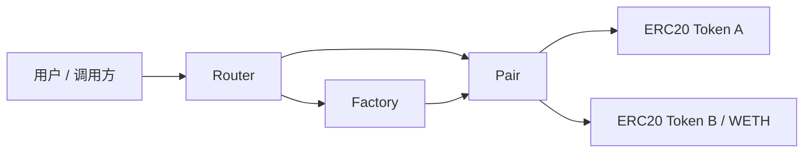

# Mini Uniswap V2

Mini Uniswap V2 是一个使用 Solidity + Foundry 实现的简化版 Uniswap V2 AMM 项目，用来学习和验证 Factory、Pair、Router、LP Token、CREATE2 确定性地址、恒定乘积 swap、流动性管理、ETH/WETH 路径、flash swap、protocol fee 和 TWAP oracle 等核心机制。

## 项目目标

- 从零实现 Uniswap V2 的核心合约结构：Factory、Pair、Router、Library。
- 理解 `x * y = k` 恒定乘积做市模型和 0.3% swap fee 的计算方式。
- 实现 LP Token 的 mint/burn、`MINIMUM_LIQUIDITY`、reserve 同步和 K 值校验。
- 使用 CREATE2 创建交易对，使 Pair 地址可以离线预测。
- 实现 Router 层的滑点保护、deadline 检查、多跳 swap 和 ETH/WETH 加减流动性。
- 实现一个简化 TWAP oracle 示例，演示如何使用 Pair 累计价格计算平均价格。
- 使用 Foundry 编写单元测试、集成测试和 invariant 测试，验证 AMM 关键安全性质。

## 核心模块

| 模块 | 文件 | 说明 |
| --- | --- | --- |
| Factory | `src/Factory.sol` | 创建并记录 token pair，使用 CREATE2 部署 Pair，管理 `feeTo` |
| Pair | `src/Pair.sol` | 管理流动性、swap、reserve、LP Token、flash swap 和 protocol fee |
| Router | `src/Router.sol` | 面向用户的入口，封装 add/remove liquidity、ETH/WETH 和 swap |
| Library | `src/Library.sol` | 提供 token 排序、Pair 地址预测、reserve 查询和兑换数量计算 |
| Oracle | `src/SimpleTwapOracle.sol` | 简化 TWAP 示例，基于 Pair 累计价格计算平均价格 |
| ERC20 | `src/ERC20.sol`、`src/UniERC20.sol` | 测试 Token 和 LP Token 基础实现，LP Token 包含 `permit` |
| Interfaces | `src/interfaces/` | Factory、Pair、WETH、Callee 等接口定义 |

## 架构



## 已实现功能

### Factory

- 创建交易对。
- 记录 `getPair[tokenA][tokenB]` 和反向映射。
- 使用 CREATE2 保证 Pair 地址可预测。
- 支持 `feeTo` 和 `feeToSetter` 权限控制。

### Pair

- `mint`：添加流动性并铸造 LP Token。
- `burn`：销毁 LP Token 并按比例返还 token。
- `swap`：执行代币兑换，并检查带 0.3% 手续费的 K 值约束。
- flash swap：`data.length > 0` 时触发 `uniswapV2Call` 回调。
- protocol fee：支持 `feeTo`、`kLast` 和 `_mintFee` 路径。
- `sync` / `skim`：同步 reserve 或取出多余余额。
- 价格累计字段：`price0CumulativeLast`、`price1CumulativeLast`。
- `getReserves`：返回当前 reserve 和最后更新时间。

### Router

- `addLiquidity` / `removeLiquidity`。
- `addLiquidityETH` / `removeLiquidityETH`。
- `swapExactTokensForTokens`。
- `swapTokensForExactTokens`。
- 多跳 swap。
- deadline 检查。
- 最小接收量和最大输入量检查。
- 多余 ETH refund。

### Library

- token 排序。
- Pair 地址预测。
- reserve 查询。
- `quote`。
- `getAmountOut`。
- `getAmountIn`。
- 多跳路径金额计算。

### SimpleTwapOracle

- 记录 Pair 的 `price0CumulativeLast` / `price1CumulativeLast`。
- 按固定 `period` 更新平均价格。
- 支持 `consult(tokenIn, amountIn)` 查询 TWAP 报价。
- 演示 V2 风格累计价格如何被外部 oracle 消费。

## 测试覆盖

当前测试覆盖 Factory 创建交易对、Library 报价计算、Pair 地址预测、reserve 顺序、LP mint/burn、swap、K invariant、skim/sync、Router 加减流动性、token swap、多跳 swap、ETH/WETH 路径、protocol fee 精确数量、flash swap、LP permit、TWAP 价格累计、TWAP oracle、Library fuzz、Router path fuzz，以及 Foundry invariant 测试。

| 测试文件 | 覆盖内容 |
| --- | --- |
| `test/Factory.t.sol` | 交易对创建、重复创建限制、token 排序、`feeTo` 和 `feeToSetter` 权限 |
| `test/Library.t.sol` | token 排序、报价公式、输入/输出金额计算、多跳路径金额计算、swap 数学 fuzz |
| `test/GetPairInitHash.t.sol` | 输出 Pair init code hash，用于校验 CREATE2 地址计算 |
| `test/PairForAndReserves.t.sol` | `pairFor` 地址预测和 `getReserves` token 顺序 |
| `test/Pair.t.sol` | LP mint/burn、swap、K revert、reserve 更新、skim/sync、protocol fee 精确数量、flash swap、permit、TWAP 累计价格 |
| `test/Router.t.sol` | add/remove liquidity、滑点、deadline、exact input/output swap、多跳 swap、Router path fuzz |
| `test/RouterETH.t.sol` | `addLiquidityETH`、ETH refund、`removeLiquidityETH`、Router receive 限制 |
| `test/SimpleTwapOracle.t.sol` | TWAP oracle 更新、报价、未更新前查询、period 限制和非法 token |
| `test/PairInvariant.t.sol` | reserve/balance 一致性、只 swap 场景下 K 不下降 |
| `test/Mocks.t.sol` | `MockWETH` 和 flash swap callback 测试辅助合约 |

当前运行结果：

```text
88 tests passed, 0 failed, 0 skipped
```

Invariant 测试默认运行结果示例：

```text
invariant_reservesMatchBalances: runs 256, calls 128000
invariant_kDoesNotDecreaseAfterSwaps: runs 256, calls 128000
```

## 快速开始

安装依赖：

```bash
forge install
```

编译：

```bash
forge build
```

运行测试：

```bash
forge test
```

运行更详细的测试输出：

```bash
forge test -vvv
```

格式化代码：

```bash
forge fmt
```

检查格式：

```bash
forge fmt --check
```

查看覆盖率：

```bash
forge coverage
```

也可以使用 Makefile：

```bash
make build
make test
make fmt-check
make coverage
```

## 前端 Demo

仓库包含一个基础可演示前端，目录为 [`frontend`](frontend)。它连接 README 和 [`deployments/sepolia.json`](deployments/sepolia.json) 中的 Sepolia 部署地址，默认演示 `DTA/DTB` pair。

功能覆盖：

- 连接 MetaMask / EIP-1193 钱包并检查 Sepolia 网络。
- 读取 Factory、Router、Pair、Oracle、DTA、DTB 状态。
- 展示 DTA/DTB reserves、spot price、LP total supply、用户 token/LP 余额和 allowance。
- 支持通过 DemoTokenFaucet 领取测试 DTA/DTB。
- 支持 `approve`、`swapExactTokensForTokens`、`addLiquidity`、`removeLiquidity` 和 `SimpleTwapOracle.update()`。
- 钱包余额不足时会禁用对应交易按钮并提示原因。

启动方式：

```bash
cd frontend
npm install
npm run dev
```

可选配置：

```bash
cp .env.example .env
# 然后设置 VITE_SEPOLIA_RPC_URL
```

如果没有配置 `VITE_SEPOLIA_RPC_URL`，前端仍可在连接钱包后通过钱包 provider 读取和发交易。普通钱包可以先通过页面里的 faucet 领取 `100 DTA + 100 DTB`，然后执行 swap 或添加流动性。

前端验证：

```bash
cd frontend
npm run typecheck
npm test
npm run build
```

### Demo Token Faucet

现有 Sepolia `DTA` / `DTB` 没有公开 mint。为了让普通钱包也能交互，已部署 [`DemoTokenFaucet`](src/DemoTokenFaucet.sol)，并由 deployer 注入了 `10,000 DTA + 10,000 DTB`。

| 项目 | 值 |
| --- | --- |
| DemoTokenFaucet | [`0xD0DE35E716681f3977f7B3A7662987ac14c6ec23`](https://sepolia.etherscan.io/address/0xD0DE35E716681f3977f7B3A7662987ac14c6ec23) |
| Claim amount | `100 DTA + 100 DTB` |
| Deploy tx | [`0x02e5ae41a5368730924c8e015332d4ca372fb01f92a3d8f817cc921a674c7545`](https://sepolia.etherscan.io/tx/0x02e5ae41a5368730924c8e015332d4ca372fb01f92a3d8f817cc921a674c7545) |

部署 faucet：

```bash
forge script script/DeployDemoTokenFaucet.s.sol:DeployDemoTokenFaucet \
  --rpc-url $SEPOLIA_RPC_URL \
  --account test \
  --sender 0xabF4020A35EB4269d99AC1AE8bf3956fceaab49A \
  --broadcast \
  --slow
```

默认每个地址可领取一次 `100 DTA + 100 DTB`。可以用环境变量调整：

```bash
FAUCET_AMOUNT_A=100000000000000000000 \
FAUCET_AMOUNT_B=100000000000000000000 \
forge script script/DeployDemoTokenFaucet.s.sol:DeployDemoTokenFaucet \
  --rpc-url $SEPOLIA_RPC_URL \
  --account test \
  --sender 0xabF4020A35EB4269d99AC1AE8bf3956fceaab49A \
  --broadcast \
  --slow
```

部署后把 token 转入 faucet：

```bash
FAUCET=<deployed_faucet_address>
cast send 0xbBE034a07215bEEb9d430A7d0A769300630EA1D1 "transfer(address,uint256)(bool)" $FAUCET 10000000000000000000000 \
  --account test --from 0xabF4020A35EB4269d99AC1AE8bf3956fceaab49A --rpc-url $SEPOLIA_RPC_URL
cast send 0x952d53e13dd115055b8BeB7EF7a2B70689Ca0622 "transfer(address,uint256)(bool)" $FAUCET 10000000000000000000000 \
  --account test --from 0xabF4020A35EB4269d99AC1AE8bf3956fceaab49A --rpc-url $SEPOLIA_RPC_URL
```

## Live / Testnet

当前已部署并验证到 Sepolia 测试网。

| 项目 | 值 |
| --- | --- |
| Network | Sepolia |
| Chain ID | `11155111` |
| Deployer | [`0xabF4020A35EB4269d99AC1AE8bf3956fceaab49A`](https://sepolia.etherscan.io/address/0xabF4020A35EB4269d99AC1AE8bf3956fceaab49A) |
| Source commit | `069b59653f8410e539e7d32ff45a502b5166bfdf` |
| Solc / optimizer | `0.8.20`, optimizer enabled, `200` runs |
| Deployment manifest | [`deployments/sepolia.json`](deployments/sepolia.json) |

| Contract | Address |
| --- | --- |
| Factory | [`0x0194528124b6c17f6210E17Da8ebC39fE42eF20b`](https://sepolia.etherscan.io/address/0x0194528124b6c17f6210E17Da8ebC39fE42eF20b) |
| DemoWETH | [`0xe687A198739a43FFB5Cf15761Bbb03EDFa5c15CB`](https://sepolia.etherscan.io/address/0xe687A198739a43FFB5Cf15761Bbb03EDFa5c15CB) |
| Router | [`0xCd1ee1570826659266F5E1907e1c6A28edbDC245`](https://sepolia.etherscan.io/address/0xCd1ee1570826659266F5E1907e1c6A28edbDC245) |
| TokenA (`DTA`) | [`0xbBE034a07215bEEb9d430A7d0A769300630EA1D1`](https://sepolia.etherscan.io/address/0xbBE034a07215bEEb9d430A7d0A769300630EA1D1) |
| TokenB (`DTB`) | [`0x952d53e13dd115055b8BeB7EF7a2B70689Ca0622`](https://sepolia.etherscan.io/address/0x952d53e13dd115055b8BeB7EF7a2B70689Ca0622) |
| Pair `DTA/DTB` | [`0x2487F862d239b779B06Bedf32F98571B9f63f2e3`](https://sepolia.etherscan.io/address/0x2487F862d239b779B06Bedf32F98571B9f63f2e3) |
| SimpleTwapOracle | [`0x3eA380833Cb9dcFb692f2e292847D258699dD5ff`](https://sepolia.etherscan.io/address/0x3eA380833Cb9dcFb692f2e292847D258699dD5ff) |
| DemoTokenFaucet | [`0xD0DE35E716681f3977f7B3A7662987ac14c6ec23`](https://sepolia.etherscan.io/address/0xD0DE35E716681f3977f7B3A7662987ac14c6ec23) |

部署命令示例：

```bash
forge script script/DeployDemo.s.sol:DeployDemo \
  --rpc-url $SEPOLIA_RPC_URL \
  --account test \
  --sender 0xabF4020A35EB4269d99AC1AE8bf3956fceaab49A \
  --broadcast \
  --slow
```

注入流动性并执行一次 demo swap：

```bash
forge script script/SeedDemoLiquidity.s.sol:SeedDemoLiquidity \
  --rpc-url $SEPOLIA_RPC_URL \
  --account test \
  --sender 0xabF4020A35EB4269d99AC1AE8bf3956fceaab49A \
  --broadcast \
  --slow \
  --gas-estimate-multiplier 200
```

默认脚本会添加 `1,000 DTA / 1,000 DTB` 流动性，并执行一次 `10 DTA -> DTB` 的 swap。如果流动性已经添加过，只想单独执行一次 swap，可以运行：

```bash
DEMO_SWAP_IN=10000000000000000000 \
forge script script/DemoSwap.s.sol:DemoSwap \
  --rpc-url $SEPOLIA_RPC_URL \
  --account test \
  --sender 0xabF4020A35EB4269d99AC1AE8bf3956fceaab49A \
  --broadcast \
  --slow \
  --gas-estimate-multiplier 200
```

已完成的 demo 交互：

| Action | Transaction |
| --- | --- |
| Add `1,000 DTA / 1,000 DTB` liquidity | [`0x194d046e1a2b131a46f927fff254ffe4aa0813406ace3f81d1336c33e23f7042`](https://sepolia.etherscan.io/tx/0x194d046e1a2b131a46f927fff254ffe4aa0813406ace3f81d1336c33e23f7042) |
| Swap `10 DTA -> DTB` | [`0xbe736552962030ee96f218d8175e4bb29e039fd58a6d9815d44b9ae52e3824bc`](https://sepolia.etherscan.io/tx/0xbe736552962030ee96f218d8175e4bb29e039fd58a6d9815d44b9ae52e3824bc) |

Swap 后 reserves：

```text
reserve0: 990128419656029387012
reserve1: 1010000000000000000000
blockTimestampLast: 1778943636
```

读状态示例：

```bash
cast call 0x0194528124b6c17f6210E17Da8ebC39fE42eF20b "feeToSetter()(address)" --rpc-url $SEPOLIA_RPC_URL
cast call 0xCd1ee1570826659266F5E1907e1c6A28edbDC245 "factory()(address)" --rpc-url $SEPOLIA_RPC_URL
cast call 0xCd1ee1570826659266F5E1907e1c6A28edbDC245 "WETH()(address)" --rpc-url $SEPOLIA_RPC_URL
cast call 0x0194528124b6c17f6210E17Da8ebC39fE42eF20b "getPair(address,address)(address)" 0xbBE034a07215bEEb9d430A7d0A769300630EA1D1 0x952d53e13dd115055b8BeB7EF7a2B70689Ca0622 --rpc-url $SEPOLIA_RPC_URL
cast call 0x2487F862d239b779B06Bedf32F98571B9f63f2e3 "getReserves()(uint112,uint112,uint32)" --rpc-url $SEPOLIA_RPC_URL
```

注意：`DemoWETH` 是本项目部署的 demo wrapped ETH 合约，不是 Sepolia 上的 canonical WETH。`SeedDemoLiquidity` 依赖部署账户仍持有足够的 `DTA` 和 `DTB`，如果已经多次运行脚本，需要先检查 token 余额或降低 seed 数量。

## 文档

- [`docs/design.md`](docs/design.md)：核心架构、AMM 数学、LP mint/burn、swap invariant、protocol fee、Router 流程和测试策略。
- [`docs/audit-notes.md`](docs/audit-notes.md)：已知限制、安全检查、已完成测试覆盖和后续审查计划。
- [`docs/debugging-archive.md`](docs/debugging-archive.md)：开发排错归档，记录可复现的错误、失败测试、原因分析和修复代码。
- [`docs/slither-report.md`](docs/slither-report.md)：Slither 静态分析记录，包含 finding 分类、风险解释和后续处理计划。

## 本地部署 Demo

项目提供 Foundry script 示例：

```bash
forge script script/DeployDemo.s.sol:DeployDemo --rpc-url <RPC_URL> --private-key <PRIVATE_KEY> --broadcast
```

脚本会部署：

- `Factory`
- demo `WETH`
- `Router`
- 两个 demo ERC20 token
- 一个 token pair
- `SimpleTwapOracle`

本地 anvil 演示时，可以先启动：

```bash
anvil
```

然后使用 anvil 输出的测试私钥运行 `forge script`。

## 目录结构

```text
.
├── .github
│   └── workflows
│       └── ci.yml
├── docs
│   ├── audit-notes.md
│   ├── debugging-archive.md
│   ├── design.md
│   └── slither-report.md
├── foundry.toml
├── Makefile
├── README.md
├── script
│   ├── DemoSwap.s.sol
│   ├── DeployDemo.s.sol
│   └── SeedDemoLiquidity.s.sol
├── src
│   ├── interfaces
│   │   ├── IUniswapV2Callee.sol
│   │   ├── IUniswapV2Factory.sol
│   │   ├── IUniswapV2Pair.sol
│   │   └── IWETH.sol
│   ├── ERC20.sol
│   ├── Factory.sol
│   ├── Library.sol
│   ├── Math.sol
│   ├── Pair.sol
│   ├── Router.sol
│   ├── SimpleTwapOracle.sol
│   ├── TransferHelper.sol
│   └── UniERC20.sol
└── test
    ├── Factory.t.sol
    ├── GetPairInitHash.t.sol
    ├── Library.t.sol
    ├── Mocks.t.sol
    ├── Pair.t.sol
    ├── PairForAndReserves.t.sol
    ├── PairInvariant.t.sol
    ├── Router.t.sol
    ├── RouterETH.t.sol
    └── SimpleTwapOracle.t.sol
```

## 与 Uniswap V2 原版的差异

- 这是简化实现，重点保留核心 AMM、Pair、Router、CREATE2、flash swap 和 protocol fee 机制。
- 没有完整生产级 Oracle / TWAP 使用方案，目前提供简化 `SimpleTwapOracle` demo 和基础测试。
- 没有支持 fee-on-transfer、rebasing、blacklist 等非标准 token。
- LP Token 已包含 `permit` 实现，并覆盖有效签名、过期签名、错误 signer 和 nonce replay 测试。
- 没有部署脚本和生产治理设计。
- 没有经过安全审计，不能用于真实资金环境。

## 后续计划

- 继续根据 Slither 记录处理剩余 findings，例如重入模式告警、pragma 固定、命名风格等。
- 给 Router ETH 路径补更多边界 fuzz。
- 补更完整的本地 demo 操作流程和截图/日志记录。
