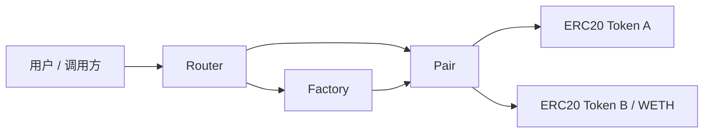

# Mini Uniswap V2

Mini Uniswap V2 是一个使用 Solidity + Foundry 实现的简化版 Uniswap V2 AMM 项目，用来学习和验证 Factory、Pair、Router、LP Token、CREATE2 确定性地址、恒定乘积 swap、流动性管理、ETH/WETH 路径、flash swap 和 protocol fee 等核心机制。

本项目用于学习和作品集展示，不适合直接用于生产环境或真实资金。

## 项目目标

- 从零实现 Uniswap V2 的核心合约结构：Factory、Pair、Router、Library。
- 理解 `x * y = k` 恒定乘积做市模型和 0.3% swap fee 的计算方式。
- 实现 LP Token 的 mint/burn、`MINIMUM_LIQUIDITY`、reserve 同步和 K 值校验。
- 使用 CREATE2 创建交易对，使 Pair 地址可以离线预测。
- 实现 Router 层的滑点保护、deadline 检查、多跳 swap 和 ETH/WETH 加减流动性。
- 使用 Foundry 编写单元测试、集成测试和 invariant 测试，验证 AMM 关键安全性质。

## 核心模块

| 模块 | 文件 | 说明 |
| --- | --- | --- |
| Factory | `src/Factory.sol` | 创建并记录 token pair，使用 CREATE2 部署 Pair，管理 `feeTo` |
| Pair | `src/Pair.sol` | 管理流动性、swap、reserve、LP Token、flash swap 和 protocol fee |
| Router | `src/Router.sol` | 面向用户的入口，封装 add/remove liquidity、ETH/WETH 和 swap |
| Library | `src/Library.sol` | 提供 token 排序、Pair 地址预测、reserve 查询和兑换数量计算 |
| ERC20 | `src/ERC20.sol`、`src/UniERC20.sol` | 测试 Token 和 LP Token 基础实现，LP Token 包含 `permit` |
| Interfaces | `src/interfaces/` | Factory、Pair、WETH、Callee 等接口定义 |

## 架构



## 已实现功能

### Factory

- 创建交易对。
- 记录 `getPair[tokenA][tokenB]` 和反向映射。
- 使用 CREATE2 保证 Pair 地址可预测。
- 支持 `feeTo` 和 `feeToSetter` 权限控制。

### Pair

- `mint`：添加流动性并铸造 LP Token。
- `burn`：销毁 LP Token 并按比例返还 token。
- `swap`：执行代币兑换，并检查带 0.3% 手续费的 K 值约束。
- flash swap：`data.length > 0` 时触发 `uniswapV2Call` 回调。
- protocol fee：支持 `feeTo`、`kLast` 和 `_mintFee` 路径。
- `sync` / `skim`：同步 reserve 或取出多余余额。
- 价格累计字段：`price0CumulativeLast`、`price1CumulativeLast`。
- `getReserves`：返回当前 reserve 和最后更新时间。

### Router

- `addLiquidity` / `removeLiquidity`。
- `addLiquidityETH` / `removeLiquidityETH`。
- `swapExactTokensForTokens`。
- `swapTokensForExactTokens`。
- 多跳 swap。
- deadline 检查。
- 最小接收量和最大输入量检查。
- 多余 ETH refund。

### Library

- token 排序。
- Pair 地址预测。
- reserve 查询。
- `quote`。
- `getAmountOut`。
- `getAmountIn`。
- 多跳路径金额计算。

## 测试覆盖

当前测试覆盖 Factory 创建交易对、Library 报价计算、Pair 地址预测、reserve 顺序、LP mint/burn、swap、K invariant、skim/sync、Router 加减流动性、token swap、多跳 swap、ETH/WETH 路径、protocol fee、flash swap、LP permit、TWAP 价格累计、Library fuzz，以及 Foundry invariant 测试。

| 测试文件 | 覆盖内容 |
| --- | --- |
| `test/Factory.t.sol` | 交易对创建、重复创建限制、token 排序、`feeTo` 和 `feeToSetter` 权限 |
| `test/Library.t.sol` | token 排序、报价公式、输入/输出金额计算、多跳路径金额计算、swap 数学 fuzz |
| `test/GetPairInitHash.t.sol` | 输出 Pair init code hash，用于校验 CREATE2 地址计算 |
| `test/PairForAndReserves.t.sol` | `pairFor` 地址预测和 `getReserves` token 顺序 |
| `test/Pair.t.sol` | LP mint/burn、swap、K revert、reserve 更新、skim/sync、protocol fee、flash swap、permit、TWAP 累计价格 |
| `test/Router.t.sol` | add/remove liquidity、滑点、deadline、exact input/output swap、多跳 swap |
| `test/RouterETH.t.sol` | `addLiquidityETH`、ETH refund、`removeLiquidityETH`、Router receive 限制 |
| `test/PairInvariant.t.sol` | reserve/balance 一致性、只 swap 场景下 K 不下降 |
| `test/Mocks.t.sol` | `MockWETH` 和 flash swap callback 测试辅助合约 |

当前运行结果：

```text
76 tests passed, 0 failed, 0 skipped
```

Invariant 测试默认运行结果示例：

```text
invariant_reservesMatchBalances: runs 256, calls 128000
invariant_kDoesNotDecreaseAfterSwaps: runs 256, calls 128000
```

## 快速开始

安装依赖：

```bash
forge install
```

编译：

```bash
forge build
```

运行测试：

```bash
forge test
```

运行更详细的测试输出：

```bash
forge test -vvv
```

格式化代码：

```bash
forge fmt
```

检查格式：

```bash
forge fmt --check
```

查看覆盖率：

```bash
forge coverage
```

也可以使用 Makefile：

```bash
make build
make test
make fmt-check
make coverage
```

## 文档

- [`docs/design.md`](docs/design.md)：核心架构、AMM 数学、LP mint/burn、swap invariant、protocol fee、Router 流程和测试策略。
- [`docs/audit-notes.md`](docs/audit-notes.md)：已知限制、安全检查、已完成测试覆盖和后续审查计划。
- [`docs/debugging-archive.md`](docs/debugging-archive.md)：开发排错归档，记录可复现的错误、失败测试、原因分析和修复代码。

## 目录结构

```text
.
├── .github
│   └── workflows
│       └── ci.yml
├── docs
│   ├── audit-notes.md
│   ├── debugging-archive.md
│   └── design.md
├── foundry.toml
├── Makefile
├── README.md
├── src
│   ├── interfaces
│   │   ├── IUniswapV2Callee.sol
│   │   ├── IUniswapV2Factory.sol
│   │   ├── IUniswapV2Pair.sol
│   │   └── IWETH.sol
│   ├── ERC20.sol
│   ├── Factory.sol
│   ├── Library.sol
│   ├── Math.sol
│   ├── Pair.sol
│   ├── Router.sol
│   ├── TransferHelper.sol
│   └── UniERC20.sol
└── test
    ├── Factory.t.sol
    ├── GetPairInitHash.t.sol
    ├── Library.t.sol
    ├── Mocks.t.sol
    ├── Pair.t.sol
    ├── PairForAndReserves.t.sol
    ├── PairInvariant.t.sol
    ├── Router.t.sol
    └── RouterETH.t.sol
```

## 与 Uniswap V2 原版的差异

- 这是简化实现，重点保留核心 AMM、Pair、Router、CREATE2、flash swap 和 protocol fee 机制。
- 没有完整生产级 Oracle / TWAP 使用方案，目前覆盖了价格累计字段和基础累计价格测试。
- 没有支持 fee-on-transfer、rebasing、blacklist 等非标准 token。
- LP Token 已包含 `permit` 实现，并覆盖有效签名、过期签名、错误 signer 和 nonce replay 测试。
- 没有部署脚本和生产治理设计。
- 没有经过安全审计，不能用于真实资金环境。

## 后续计划

- 补 Router path 的 fuzz test。
- 补面向调用方的 TWAP library 或 TWAP demo。
- 继续细化 protocol fee 的精确数量断言。
- 给 Router ETH 路径补更多失败分支。
- 增加部署脚本和本地 demo 流程。
