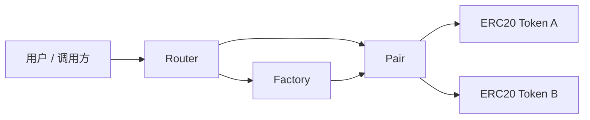

# Mini Uniswap V2

Mini Uniswap V2 是一个使用 Solidity 和 Foundry 实现的 Uniswap V2 简化版本，用来学习和验证 AMM、LP Token、CREATE2 确定性地址、流动性添加/移除、代币兑换等核心机制。


## 项目目标

- 从零实现 Uniswap V2 的核心合约结构：Factory、Pair、Router、Library。
- 理解 `x * y = k` 恒定乘积做市模型和 0.3% swap fee 的计算方式。
- 实现 LP Token 的 mint/burn 逻辑，以及首次添加流动性时的 `MINIMUM_LIQUIDITY` 处理。
- 使用 CREATE2 创建交易对，使 Pair 地址可以离线预测。
- 使用 Foundry 编写测试，验证 Pair 地址计算、reserve 顺序和基础流动性逻辑。

## 核心模块

| 模块 | 文件 | 说明 |
| --- | --- | --- |
| Factory | `src/Factory.sol` | 创建并记录 token pair，使用 CREATE2 部署 Pair |
| Pair | `src/Pair.sol` | 管理流动性、swap、reserve、LP Token 和手续费逻辑 |
| Router | `src/Router.sol` | 面向用户的入口，封装 add/remove liquidity 和 swap |
| Library | `src/Library.sol` | 提供 token 排序、pair 地址预测、报价和兑换数量计算 |
| ERC20 | `src/ERC20.sol`、`src/UniERC20.sol` | 测试 Token 和 LP Token 基础实现 |
| Interfaces | `src/interfaces/` | Factory、Pair、WETH、Callee 等接口定义 |

## 架构



## 已实现功能

- Factory
  - 创建交易对
  - 记录 `getPair[tokenA][tokenB]`
  - 使用 CREATE2 保证 Pair 地址可预测

- Pair
  - `mint`：添加流动性并铸造 LP Token
  - `burn`：销毁 LP Token 并按比例返还 token
  - `swap`：执行代币兑换并检查 K 值约束
  - `sync` / `skim`：同步或取出多余余额
  - `getReserves`：返回当前储备量

- Router
  - 添加流动性
  - 移除流动性
  - exact input swap
  - deadline 检查
  - 最小接收量检查

- Library
  - token 排序
  - pair 地址预测
  - reserve 查询
  - `quote`
  - `getAmountOut`
  - `getAmountIn`
  - 多跳路径金额计算

## 测试覆盖

当前测试主要覆盖 Factory 创建交易对、Library 报价计算、Pair 地址预测、reserve 顺序和首次添加流动性等基础路径。

| 测试文件 | 覆盖内容 |
| --- | --- |
| `test/Factory.t.sol` | 验证交易对创建、重复创建限制、token 排序、feeTo 和 feeToSetter 权限 |
| `test/Library.t.sol` | 验证 token 排序、报价公式、输入/输出金额计算和多跳路径金额计算 |
| `test/GetPairInitHash.t.sol` | 输出 Pair init code hash，用于校验 CREATE2 地址计算 |
| `test/PairForAndReserves.t.sol` | 验证 `pairFor` 地址预测和 `getReserves` token 顺序 |
| `test/Pair.t.sol` | 验证首次 mint LP Token 和流动性不足时 revert |

运行结果：

```text
31 tests passed, 0 failed, 0 skipped
```

## 快速开始

安装依赖：

```bash
forge install
```

编译：

```bash
forge build
```

运行测试：

```bash
forge test -vvv
```

格式化代码：

```bash
forge fmt
```

查看覆盖率：

```bash
forge coverage
```

## 目录结构

```text
.
├── foundry.toml
├── src
│   ├── interfaces
│   │   ├── IUniswapV2Callee.sol
│   │   ├── IUniswapV2Factory.sol
│   │   ├── IUniswapV2Pair.sol
│   │   └── IWETH.sol
│   ├── ERC20.sol
│   ├── Factory.sol
│   ├── Library.sol
│   ├── Math.sol
│   ├── Pair.sol
│   ├── Router.sol
│   ├── TransferHelper.sol
│   └── UniERC20.sol
└── test
    ├── Factory.t.sol
    ├── GetPairInitHash.t.sol
    ├── Library.t.sol
    ├── Pair.t.sol
    └── PairForAndReserves.t.sol
```

## 与 Uniswap V2 原版的差异

- 这是简化实现，重点保留核心 AMM、Pair、Router 和 CREATE2 机制。
- 没有完整实现生产级 Oracle / TWAP 能力。
- 没有支持 fee-on-transfer token。
- 没有实现 Permit。
- 没有经过安全审计，不能用于真实资金环境。

## 后续计划

- 补充 Pair 的二次 mint、burn、swap、K invariant 和 reserve 更新测试。
- 补充 Router 的 add/remove liquidity、swap、deadline 和滑点测试。
- 增加 fuzz tests 和 invariant tests，重点验证 K 值约束和 reserve/balance 一致性。
- 增加部署脚本和本地 demo 流程。
- 编写 `docs/design.md`，整理 AMM 数学推导和核心设计取舍。
- 编写 `docs/audit-notes.md`，记录已知风险和安全限制。
