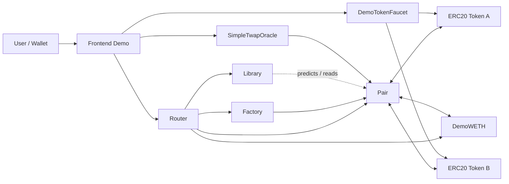

# Mini Uniswap V2

Mini Uniswap V2 是一个使用 Solidity + Foundry 实现的简化版 Uniswap V2 AMM 项目，用于学习和验证 Factory、Pair、Router、LP Token、CREATE2 确定性地址、恒定乘积 swap、ETH/WETH 路径、flash swap、protocol fee 和 TWAP oracle 等核心机制。

## 核心功能

| 模块 | 文件 | 说明 |
| --- | --- | --- |
| Factory | `src/Factory.sol` | 使用 CREATE2 创建 Pair，记录双向 `getPair`，管理 `feeTo` |
| Pair | `src/Pair.sol` | 管理流动性、swap、reserve、LP Token、flash swap、protocol fee 和 TWAP 累计价格 |
| Router | `src/Router.sol` | 封装加减流动性、滑点保护、deadline、多跳 swap 和 ETH/WETH 路径 |
| Library | `src/Library.sol` | token 排序、Pair 地址预测、reserve 查询和兑换数量计算 |
| Oracle | `src/SimpleTwapOracle.sol` | 基于 Pair 累计价格计算固定窗口 TWAP 报价 |
| Demo | `src/DemoTokenFaucet.sol`、`frontend/` | Sepolia 演示 faucet 和前端交互页面 |

已实现能力：

- `x * y = k` 恒定乘积做市模型和 0.3% swap fee。
- LP Token mint/burn、`MINIMUM_LIQUIDITY`、reserve 同步和 K 值校验。
- CREATE2 Pair 地址预测，Router 可离线计算 Pair 地址。
- `addLiquidity` / `removeLiquidity` / `swapExactTokensForTokens` / `swapTokensForExactTokens`。
- `addLiquidityETH` / `removeLiquidityETH`、WETH unwrap 和多余 ETH refund。
- flash swap callback，交易结束前通过 K 值约束校验还款。
- protocol fee：`feeTo`、`kLast` 和 `_mintFee` 路径。
- LP Token `permit`，覆盖有效签名、过期签名、错误 signer 和 nonce replay。
- 简化 TWAP oracle，演示 V2 累计价格的外部消费方式。

## 架构



核心交易路径是 `User -> Frontend -> Router -> Pair`。`Factory` 负责创建 Pair，`Library` 负责地址预测和报价计算，`SimpleTwapOracle` 只读取 Pair 的累计价格；`DemoTokenFaucet` 和前端属于 Sepolia 演示层。

## 快速开始

```bash
forge install
forge build
forge test
```

常用命令：

```bash
make build
make test
make fmt-check
make coverage
```

前端 demo：

```bash
cd frontend
npm install
npm run dev
```

前端检查：

```bash
cd frontend
npm run typecheck
npm test
npm run build
```

## 测试与安全验证

当前 `forge test` 结果：

```text
96 tests passed, 0 failed, 0 skipped
```

覆盖范围包括：

- Factory：Pair 创建、重复创建限制、token 排序、`feeTo` / `feeToSetter` 权限。
- Library：报价公式、输入/输出金额计算、多跳路径计算和 fuzz 测试。
- Pair：LP mint/burn、swap、K revert、reserve 更新、skim/sync、protocol fee、flash swap、permit、TWAP 累计价格。
- Router：滑点、deadline、exact input/output swap、多跳 swap、ETH/WETH 路径和 path fuzz。
- Oracle：period 限制、平均价格更新、非法 token 和未更新前查询。
- Invariant：reserve/balance 一致性，以及只 swap 场景下 K 不下降。

Slither 静态分析记录见 [`docs/slither-report.md`](docs/slither-report.md)。当前已处理主要 unchecked transfer、关键零地址检查和部分 `constant` / `immutable` 优化；剩余 finding 已在审计笔记中按误报、设计预期和后续加固项分类。

## Sepolia Demo

当前已部署并验证到 Sepolia 测试网，完整 manifest 见 [`deployments/sepolia.json`](deployments/sepolia.json)。

| 项目 | 值 |
| --- | --- |
| Network | Sepolia |
| Chain ID | `11155111` |
| Source commit | `069b59653f8410e539e7d32ff45a502b5166bfdf` |
| Solc / optimizer | `0.8.20`, optimizer enabled, `200` runs |

| Contract | Address |
| --- | --- |
| Factory | [`0x0194528124b6c17f6210E17Da8ebC39fE42eF20b`](https://sepolia.etherscan.io/address/0x0194528124b6c17f6210E17Da8ebC39fE42eF20b) |
| DemoWETH | [`0xe687A198739a43FFB5Cf15761Bbb03EDFa5c15CB`](https://sepolia.etherscan.io/address/0xe687A198739a43FFB5Cf15761Bbb03EDFa5c15CB) |
| Router | [`0xCd1ee1570826659266F5E1907e1c6A28edbDC245`](https://sepolia.etherscan.io/address/0xCd1ee1570826659266F5E1907e1c6A28edbDC245) |
| TokenA (`DTA`) | [`0xbBE034a07215bEEb9d430A7d0A769300630EA1D1`](https://sepolia.etherscan.io/address/0xbBE034a07215bEEb9d430A7d0A769300630EA1D1) |
| TokenB (`DTB`) | [`0x952d53e13dd115055b8BeB7EF7a2B70689Ca0622`](https://sepolia.etherscan.io/address/0x952d53e13dd115055b8BeB7EF7a2B70689Ca0622) |
| Pair `DTA/DTB` | [`0x2487F862d239b779B06Bedf32F98571B9f63f2e3`](https://sepolia.etherscan.io/address/0x2487F862d239b779B06Bedf32F98571B9f63f2e3) |
| SimpleTwapOracle | [`0x3eA380833Cb9dcFb692f2e292847D258699dD5ff`](https://sepolia.etherscan.io/address/0x3eA380833Cb9dcFb692f2e292847D258699dD5ff) |
| DemoTokenFaucet | [`0xD0DE35E716681f3977f7B3A7662987ac14c6ec23`](https://sepolia.etherscan.io/address/0xD0DE35E716681f3977f7B3A7662987ac14c6ec23) |

Demo faucet 每个地址可领取一次 `100 DTA + 100 DTB`。前端连接 Sepolia 后可执行：

- 查看 reserves、spot price、LP total supply、余额和 allowance。
- 领取测试 token。
- `approve`、swap、添加/移除流动性。
- 调用 `SimpleTwapOracle.update()` 并读取 TWAP 报价。

注意：`DemoWETH` 是本项目部署的 demo wrapped ETH 合约，不是 Sepolia canonical WETH。

## 部署脚本

本地 anvil：

```bash
anvil
forge script script/DeployDemo.s.sol:DeployDemo \
  --rpc-url http://127.0.0.1:8545 \
  --private-key <ANVIL_PRIVATE_KEY> \
  --broadcast
```

Sepolia 示例：

```bash
forge script script/DeployDemo.s.sol:DeployDemo \
  --rpc-url $SEPOLIA_RPC_URL \
  --account test \
  --sender <SENDER_ADDRESS> \
  --broadcast \
  --slow
```

注入 demo 流动性：

```bash
forge script script/SeedDemoLiquidity.s.sol:SeedDemoLiquidity \
  --rpc-url $SEPOLIA_RPC_URL \
  --account test \
  --sender <SENDER_ADDRESS> \
  --broadcast \
  --slow \
  --gas-estimate-multiplier 200
```

部署 faucet：

```bash
forge script script/DeployDemoTokenFaucet.s.sol:DeployDemoTokenFaucet \
  --rpc-url $SEPOLIA_RPC_URL \
  --account test \
  --sender <SENDER_ADDRESS> \
  --broadcast \
  --slow
```

## 文档

- [`docs/design.md`](docs/design.md)：架构、AMM 数学、LP mint/burn、swap invariant、protocol fee、Router 流程和测试策略。
- [`docs/audit-notes.md`](docs/audit-notes.md)：已知限制、安全检查、测试覆盖和后续审查计划。
- [`docs/slither-report.md`](docs/slither-report.md)：Slither finding 分类、风险解释和处理计划。
- [`docs/debugging-archive.md`](docs/debugging-archive.md)：开发排错记录。

## 主要目录结构

```text
.
├── deployments
│   └── sepolia.json
├── docs
│   ├── audit-notes.md
│   ├── debugging-archive.md
│   ├── design.md
│   └── slither-report.md
├── frontend
│   └── src
├── script
│   ├── DemoSwap.s.sol
│   ├── DeployDemo.s.sol
│   ├── DeployDemoTokenFaucet.s.sol
│   └── SeedDemoLiquidity.s.sol
├── src
│   ├── interfaces
│   ├── DemoTokenFaucet.sol
│   ├── ERC20.sol
│   ├── Factory.sol
│   ├── Library.sol
│   ├── Math.sol
│   ├── Pair.sol
│   ├── Router.sol
│   ├── SimpleTwapOracle.sol
│   ├── TransferHelper.sol
│   └── UniERC20.sol
└── test
    ├── DemoTokenFaucet.t.sol
    ├── Factory.t.sol
    ├── GetPairInitHash.t.sol
    ├── Library.t.sol
    ├── Mocks.t.sol
    ├── Pair.t.sol
    ├── PairForAndReserves.t.sol
    ├── PairInvariant.t.sol
    ├── Router.t.sol
    ├── RouterETH.t.sol
    └── SimpleTwapOracle.t.sol
```

## 与 Uniswap V2 原版的差异

- 这是学习型简化实现，保留核心 AMM、Pair、Router、CREATE2、flash swap、protocol fee 和 TWAP 累计价格机制。
- Oracle 仅提供 `SimpleTwapOracle` demo，不包含生产级窗口设计、操纵成本建模、多数据源校验或异常价格处理。
- 不支持 fee-on-transfer、rebasing、pausable、blacklist 等非标准 token。
- 访问控制保持简化，没有 timelock、multisig 或治理延迟。
- Slither 已做静态分析和分类记录，但项目没有经过正式安全审计，不能用于真实资金环境。
